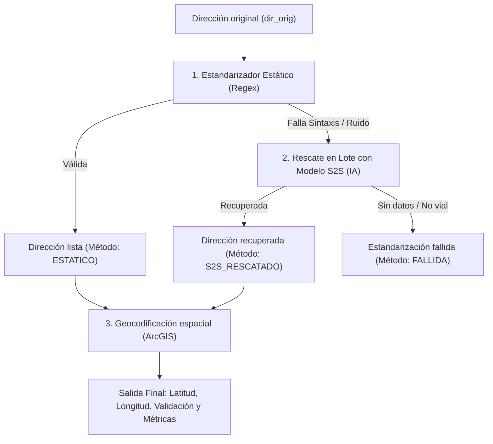

# 📍 S2S Geocoder & Address Standardizer (Universidad ICESI)

Módulo aislado para la **estandarización inteligente y geocodificación** de direcciones colombianas (especializado en Cali y Valle del Cauca), combinando reglas gramaticales fijas, un modelo de lenguaje **Sequence-to-Sequence (S2S)** para rescate de casos atípicos/ruidosos, y georreferenciación espacial con **ArcGIS**.

---

## 🚀 Inicio Rápido

### 1. Activar el entorno virtual
En Windows PowerShell:
```powershell
.\venv\Scripts\Activate.ps1
```

### 2. Iniciar la Interfaz Gráfica (Streamlit GUI)
Puedes iniciarlo de cualquiera de estas dos formas:
```bash
python main.py
# o bien:
streamlit run app.py
```
Esto abrirá automáticamente la aplicación web en tu navegador (`http://localhost:8501`).

### 3. Uso por Línea de Comandos (CLI Batch)
Para procesar archivos masivos directamente desde la consola:
```bash
python main.py --input data/mis_direcciones.xlsx --col dir_orig --output results/geocodificadas.xlsx
```
Opciones disponibles:
* `--input` / `-i`: Ruta al archivo Excel (`.xlsx`, `.xls`) o CSV (`.csv`).
* `--col` / `-c`: Nombre de la columna con las direcciones originales (por defecto: `dir_orig`).
* `--output` / `-o`: Ruta donde guardar el archivo resultante.
* `--city`: Ciudad para búsqueda en ArcGIS (por defecto: `Cali`).
* `--country`: Región/País (por defecto: `Valle del Cauca, Colombia`).
* `--no-s2s`: Desactivar el modelo neuronal y usar solo el estandarizador estático.
* `--batch-size` / `-b`: Tamaño de lote para inferencia S2S (por defecto: `64`).

---

## 🧠 Arquitectura del Flujo de Estandarización



---

## 📁 Estructura del Proyecto

```
s2s_geocoder/
├── app.py                          # Interfaz gráfica en Streamlit con dashboard interactivo
├── main.py                         # Entrypoint dual (GUI y CLI)
├── requirements.txt                # Dependencias del proyecto (incluye streamlit y plotly)
├── .env                            # Variables de configuración
├── s2s_model/                      # Pesos y archivos del modelo S2S (Hugging Face)
│   ├── model.safetensors
│   ├── config.json
│   ├── spiece.model
│   └── tokenizer_config.json
└── src/
    ├── config.py                   # Configuración del proyecto y variables de entorno
    ├── address_standardization/    # Módulos de estandarización
    │   ├── model_resources.py
    │   ├── s2s_address_standardizer.py
    │   └── static_address_standardizer.py
    ├── pipelines/                  # Pipelines de procesamiento modular
    │   ├── __init__.py
    │   └── geocodification_pipeline.py
    ├── exceptions/                 # Tipos de errores y validaciones
    ├── logger/                     # Configuración de logs con nivel DATA-QUALITY
    └── utils/                      # Lectura y guardado de datos
```

---

## 📊 Características de la Interfaz Web (Streamlit)

1. **Subida Drag & Drop:** Carga archivos `.xlsx`, `.xls` o `.csv` con selección automática o manual de la columna de direcciones.
2. **Dashboard de Métricas (KPIs):**
   * Total de direcciones procesadas.
   * Porcentaje y conteo de geocodificadas con éxito.
   * Porcentaje y conteo de **direcciones rescatadas gracias a la IA (S2S)**.
   * Conteo de no localizables o con fallo en estandarización.
3. **Gráficos Interactivos:**
   * Gráfico de dona con distribución de métodos de estandarización.
   * Gráfico de dona con resultados de geocodificación.
   * Tabla resumen de indicadores.
4. **Visualización en Mapa:** Muestra las direcciones geocodificadas directamente sobre el mapa interactivo.
5. **Explorador y Filtros:** Permite filtrar la tabla para auditar fácilmente solo las rescatadas por S2S, solo las fallidas, etc.
6. **Exportación:** Descarga de los resultados procesados en formato Excel (`.xlsx`) o CSV (`.csv`).
