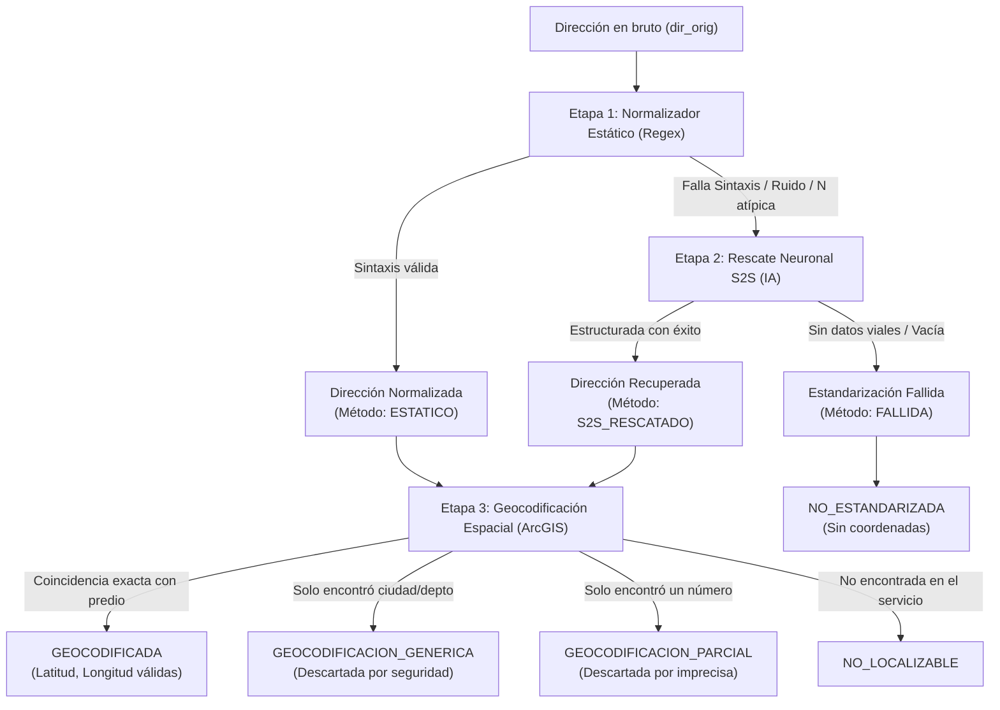

# 📍 S2S Geocoder & Address Standardizer (Universidad ICESI)

Sistema integral de **estandarización inteligente y geocodificación de direcciones colombianas** (especializado en Cali y Valle del Cauca), desarrollado en el marco de proyectos de investigación del laboratorio **IAsLab** (Universidad ICESI).

Combina una capa rápida de reglas gramaticales y expresiones regulares, un modelo neuronal **Sequence-to-Sequence (S2S)** para rescatar direcciones atípicas o ruidosas, y georreferenciación espacial de alta precisión mediante **ArcGIS Geocoder**, con validación semántica contra falsos positivos.

---

## 📑 Tabla de Contenido

- [El Problema y la Solución](#-el-problema-y-la-solución)
- [Arquitectura del Flujo de Trabajo](#-arquitectura-del-flujo-de-trabajo)
- [Instalación y Configuración desde Cero](#-instalación-y-configuración-desde-cero)
  - [1. Requisitos Previos](#1-requisitos-previos)
  - [2. Clonar o Descargar el Repositorio](#2-clonar-o-descargar-el-repositorio)
  - [3. Crear y Activar el Entorno Virtual](#3-crear-y-activar-el-entorno-virtual)
  - [4. Instalar Dependencias](#4-instalar-dependencias)
  - [5. Archivo de Configuración (.env)](#5-archivo-de-configuración-env)
  - [6. Pesos del Modelo S2S](#6-pesos-del-modelo-s2s)
- [Modos de Uso: ¿Cuándo usar GUI vs CLI?](#-modos-de-uso-cuándo-usar-gui-vs-cli)
  - [Comparativa Rápida](#comparativa-rápida)
  - [¿Cuándo es mejor usar el modo CLI?](#cuándo-es-mejor-usar-el-modo-cli)
  - [¿Cuándo es mejor usar el modo GUI (Streamlit)?](#cuándo-es-mejor-usar-el-modo-gui-streamlit)
- [Modo CLI (Línea de Comandos)](#-modo-cli-línea-de-comandos)
  - [Parámetros Disponibles](#parámetros-disponibles)
  - [Ejemplos Prácticos de CLI](#ejemplos-prácticos-de-cli)
  - [Mecanismo de Checkpoints y Reanudación](#mecanismo-de-checkpoints-y-reanudación)
- [Modo GUI (Interfaz Web Streamlit)](#-modo-gui-interfaz-web-streamlit)
  - [Cómo Iniciar la GUI](#cómo-iniciar-la-gui)
  - [Secciones y Funcionalidades](#secciones-y-funcionalidades)
- [Diccionario de Datos (Columnas de Salida)](#-diccionario-de-datos-columnas-de-salida)
- [Estructura del Proyecto](#-estructura-del-proyecto)
- [Logs y Auditoría de Calidad](#-logs-y-auditoría-de-calidad)
- [Solución de Problemas Frecuentes (FAQ)](#-solución-de-problemas-frecuentes-faq)

---

## 🎯 El Problema y la Solución

Las direcciones en Colombia presentan una alta variabilidad y ruido en bases de datos institucionales (salud, epidemiología, catastro, encuestas):
- Abreviaturas inconsistentes (`CLL`, `CL`, `KRA`, `CR`, `DG`, `AVDA`).
- Omisiones de separadores estándar como el numeral `#` o el guion `-` (`CL 5 14 20`, `KR 1 A 44 12`).
- Palabras parásitas o complementos incrustados en la dirección (`APTO 301`, `BARRIO SAN FERNANDO`, `ETAPA 2`).
- Errores tipográficos y caracteres especiales confusos (`Ñ`, sufijos dobles, etc.).

Los geocodificadores comerciales tradicionales suelen fallar o asignar coordenadas erróneas (como el centroide genérico de la ciudad) ante direcciones mal estructuradas. 

**`s2s_geocoder` resuelve esto mediante un enfoque híbrido en cascada:**
1. **Normalizador Estático:** Resuelve instantáneamente el 70-85% de las direcciones mediante patrones y gramáticas regulares.
2. **Rescate Neuronal S2S:** Un modelo de lenguaje Sequence-to-Sequence (basado en arquitectura T5 / ByT5 reentrenada para direcciones colombianas) predice y reconstruye la dirección estándar a partir de entradas complejas.
3. **Geocodificación con ArcGIS + Validación Semántica:** Consulta las coordenadas y valida que el resultado corresponda a una dirección predial real y no a un centroide genérico ni a una aproximación numérica incompleta.

---

## 🧠 Arquitectura del Flujo de Trabajo



---

## 💻 Instalación y Configuración desde Cero

### 1. Requisitos Previos
- **Sistema Operativo:** Windows 10/11, Linux o macOS.
- **Python:** Versión **3.10** o **3.11** (recomendado: 3.11).
- **Conexión a Internet:** Requerida para consultar el servicio de geocodificación de ArcGIS.
- **Aceleración por GPU (Opcional):** Si cuentas con una tarjeta gráfica NVIDIA con soporte CUDA, PyTorch la detectará automáticamente para acelerar la inferencia del modelo S2S. Si no tienes GPU, funcionará en CPU sin problemas.

---

### 2. Clonar o Descargar el Repositorio
Abre tu terminal favorita (PowerShell, Git Bash o CMD) y sitúate en el directorio del proyecto:
```bash
git clone <URL_DEL_REPOSITORIO>
cd s2s_geocoder
```

---

### 3. Crear y Activar el Entorno Virtual

#### En Windows (PowerShell):
```powershell
python -m venv venv
.\venv\Scripts\Activate.ps1
```
> [!TIP]
> Si PowerShell muestra un error de políticas de ejecución (`execution of scripts is disabled on this system`), ejecuta en esa sesión:
> ```powershell
> Set-ExecutionPolicy -Scope Process -ExecutionPolicy Bypass
> .\venv\Scripts\Activate.ps1
> ```

#### En Windows (CMD):
```cmd
python -m venv venv
.\venv\Scripts\activate.bat
```

#### En Linux / macOS:
```bash
python3 -m venv venv
source venv/bin/activate
```

---

### 4. Instalar Dependencias
Con el entorno virtual activado, instala todas las librerías necesarias:
```bash
pip install --upgrade pip
pip install -r requirements.txt
```

---

### 5. Archivo de Configuración (`.env`)
El proyecto incluye un archivo `.env` en la raíz con las rutas de trabajo predeterminadas:
```env
RESULTS_FOLDER=./results/
S2S_MODEL_PATH=./s2s_model
LOGS_PATH=./logs/general_logs.log
```
- `RESULTS_FOLDER`: Carpeta destino sugerida para archivos generados.
- `S2S_MODEL_PATH`: Ruta a la carpeta que contiene los pesos del modelo S2S.
- `LOGS_PATH`: Ruta al archivo central de logs.

---

### 6. Pesos del Modelo S2S
Para habilitar el rescate por Inteligencia Artificial, la carpeta `s2s_model/` en la raíz del proyecto debe contener los siguientes archivos:
```
s2s_model/
├── model.safetensors         # Pesos de la red neuronal (~1.2 GB)
├── config.json               # Configuración del modelo Hugging Face
├── generation_config.json    # Parámetros de beam search y decodificación
├── spiece.model              # Modelo de tokenización SentencePiece
├── tokenizer_config.json     # Configuración del tokenizador
├── special_tokens_map.json   # Mapeo de tokens especiales
└── added_tokens.json         # Tokens del vocabulario específico
```
> [!NOTE]
> Si ejecutas el proyecto sin el modelo S2S, puedes usar la bandera `--no-s2s` en el modo CLI o desactivarlo en la barra lateral de la GUI. En ese caso, el sistema funcionará únicamente con el normalizador estático de reglas.

---

## ⚖️ Modos de Uso: ¿Cuándo usar GUI vs CLI?

El proyecto ofrece dos puntos de entrada principales: una **Interfaz Web Interactiva (GUI Streamlit)** y una **Línea de Comandos (CLI)**.

### Comparativa Rápida

| Criterio | Modo GUI (Streamlit) | Modo CLI (Terminal) |
| :--- | :--- | :--- |
| **Volumen de datos recomendado** | 1 a 2,000 registros | 1 a 100,000+ registros |
| **Monitoreo visual** | Gráficos de dona Plotly, mapa interactivo | Barras `tqdm` dinámicas en consola |
| **Tolerancia a fallos y pausas** | Si cierras el navegador, se reinicia | **Checkpoints automáticos**, pausa con `Ctrl+C` y reanudación segura |
| **Consumo de recursos** | Mayor (renderiza navegador y gráficos) | Mínimo y optimizado (solo cálculo e I/O) |
| **Automatización / Cron jobs** | No | **Sí** (ideal para pipelines y servidores headless) |
| **Perfil de usuario** | Analistas, revisiones rápidas, demostraciones | Ingenieros de datos, procesamiento batch masivo |

---

### ¿Cuándo es mejor usar el modo CLI?

El modo CLI es la opción recomendada cuando:
1. **Procesas archivos grandes (> 2,000 direcciones):** La geocodificación mediante llamadas HTTP a ArcGIS toma aproximadamente entre 0.1 y 0.3 segundos por dirección. Para 10,000 registros, el proceso puede tardar entre 25 y 45 minutos. En la interfaz web, un refresco accidental del navegador o un corte de red perdería el estado; en el CLI, el progreso se almacena de forma segura e incremental en disco.
2. **Necesitas tolerancia a fallos y reanudación:** El CLI guarda un **checkpoint** cada N filas (por defecto cada 50). Si se cae la conexión a internet, se va la energía o presionas `Ctrl+C`, simplemente vuelves a ejecutar el mismo comando y continuará exactamente en la fila donde quedó.
3. **Ejecutas en servidores remotos o instancias cloud:** En servidores sin entorno gráfico (Linux sin GUI, Docker, máquinas virtuales AWS/GCP/Azure) o en tareas programadas (Airflow, Cron, Celery).
4. **Quieres velocidad pura sin sobrecarga:** Puedes ajustar el tamaño de lote del modelo S2S (`--batch-size 128` o `256`) para aprovechar al máximo tu GPU.

---

### ¿Cuándo es mejor usar el modo GUI (Streamlit)?

El modo GUI es ideal cuando:
1. Quieres explorar un archivo nuevo de forma rápida sin escribir comandos.
2. Necesitas visualizar las direcciones geocodificadas en un **mapa interactivo** para verificar la dispersión espacial.
3. Quieres auditar visualmente qué direcciones específicas fueron rescatadas por el modelo neuronal mediante filtros rápidos.
4. Deseas descargar reportes en Excel con gráficos y KPIs de resumen listos para presentaciones o informes de calidad de datos.

---

## 💻 Modo CLI (Línea de Comandos)

### Parámetros Disponibles

El comando general de ejecución es:
```bash
python src/main.py --input <ARCHIVO_ENTRADA> [OPCIONES]
```

| Parámetro | Forma Corta | Tipo | Por Defecto | Descripción |
| :--- | :---: | :---: | :---: | :--- |
| `--input` | `-i` | String | *Requerido* | Ruta al archivo Excel (`.xlsx`, `.xls`) o CSV (`.csv`) a procesar. |
| `--output` | `-o` | String | Auto-generado | Ruta donde se guardará el resultado final. Si no se pasa, genera `<nombre>_geocoded.xlsx` en la misma carpeta. |
| `--col` | `-c` | String | `dir_orig` | Nombre exacto de la columna en el archivo que contiene las direcciones originales. |
| `--city` | | String | `Cali` | Ciudad para acotar la búsqueda en ArcGIS (evita falsos positivos en otras ciudades). |
| `--country` | | String | `Valle del Cauca, Colombia` | Región, departamento o país para el contexto geográfico. |
| `--batch-size` | `-b` | Entero | `64` | Tamaño de lote para la inferencia con el modelo S2S (subir a 128 si tienes GPU potente). |
| `--no-s2s` | | Flag | `False` | Desactiva el modelo neuronal S2S y ejecuta únicamente el normalizador estático de reglas. |
| `--checkpoint` | | String | Auto-generado | Ruta personalizada para el archivo temporal de checkpoint (`.csv`). |
| `--checkpoint-interval` | | Entero | `50` | Frecuencia en filas con la que se guarda el progreso en disco. |
| `--no-checkpoint` | | Flag | `False` | Desactiva por completo el sistema de checkpoints intermedios. |
| `--keep-checkpoint` | | Flag | `False` | Conserva el archivo de checkpoint en disco incluso tras terminar exitosamente. |
| `--force` | | Flag | `False` | Ignora y elimina cualquier checkpoint previo existente, forzando a reprocesar todo desde cero. |
| `--gui` | | Flag | `False` | Lanza la interfaz gráfica web en lugar de ejecutar la terminal. |

---

### Ejemplos Prácticos de CLI

#### 1. Ejecución básica con archivo Excel de ejemplo
```bash
python src/main.py --input data/prueba.xlsx
```
*Toma la columna `dir_orig` por defecto, aplica el normalizador estático + modelo S2S, geocodifica en Cali y genera `data/prueba_geocoded.xlsx`.*

#### 2. Archivo con columna personalizada y ruta de salida específica
```bash
python src/main.py --input mis_datos.xlsx --col DIRECCION --output resultados/final.xlsx
```

#### 3. Procesamiento masivo de 10,000 registros con checkpoints frecuentes y lote mayor
```bash
python src/main.py -i data/prueba_10000.xlsx -c dir_orig -o results/prueba_10000_geo.xlsx --batch-size 128 --checkpoint-interval 25
```

#### 4. Modo ultra rápido sin modelo neuronal (solo reglas estáticas)
Si tienes un archivo gigantesco y solo deseas limpiar y geocodificar lo que cumpla sintaxis estándar al instante:
```bash
python src/main.py -i data/prueba_1000.xlsx --no-s2s
```

#### 5. Cambiar el contexto geográfico a otra ciudad
```bash
python src/main.py -i data/direcciones_palmira.xlsx --city "Palmira" --country "Valle del Cauca, Colombia"
```

#### 6. Forzar reprocesamiento desde cero ignorando checkpoints anteriores
```bash
python src/main.py -i data/prueba.xlsx --force
```

---

### Mecanismo de Checkpoints y Reanudación

El geocodificador incluye un sistema de seguridad de datos de nivel industrial:
1. **Guardado atómico:** El checkpoint se escribe primero en un archivo temporal (`.tmp`) y luego se reemplaza atómicamente para evitar que un corte de energía corrompa el archivo.
2. **Reanudación transparente:** Si el proceso se detiene en la fila 3,420 de 10,000, simplemente vuelve a lanzar el mismo comando:
   ```bash
   python src/main.py -i data/prueba_10000.xlsx
   ```
   El sistema detectará el archivo de checkpoint existente, cargará las filas ya estandarizadas y geocodificadas, y continuará a partir de la fila 3,421.
3. **Manejo de interrupciones:** Puedes presionar `Ctrl+C` en cualquier momento; el programa guardará el punto exacto antes de salir limpiamente.
4. **Limpieza automática:** Al finalizar el 100% del archivo y guardar exitosamente el archivo final, el checkpoint temporal se elimina automáticamente para no ocupar espacio innecesario (a menos que uses `--keep-checkpoint`).
5. **Protección contra archivos bloqueados en Excel:** Si tienes el archivo de salida abierto en Excel al momento en que el script intenta guardar, el sistema no fallará ni perderá datos: guardará una copia con timestamp (ej. `resultado_1714829100.xlsx`) y mantendrá el checkpoint a salvo.

---

## 🌐 Modo GUI (Interfaz Web Streamlit)

### Cómo Iniciar la GUI

Puedes iniciar la interfaz gráfica desde la raíz del proyecto de cualquiera de estas dos formas:
```bash
python src/main.py
# o bien:
python src/main.py --gui
# o directamente con Streamlit:
streamlit run src/app.py
```
Se abrirá automáticamente en tu navegador web en la dirección:
👉 **`http://localhost:8501`**

---

### Secciones y Funcionalidades

```
┌────────────────────────────────────────────────────────────────────────┐
│  📍 Geocodificador Inteligente de Direcciones (ICESI)                  │
├───────────────────┬────────────────────────────────────────────────────┤
│ ⚙️ SIDEBAR        │ 📂 CARGA DE ARCHIVO                                │
│ - Dispositivo     │   [ Arrastra y suelta tu archivo .xlsx o .csv ]    │
│   (CPU / GPU)     │                                                    │
│ - Check S2S Model │ 📋 SELECCIÓN DE COLUMNA Y BOTÓN EJECUTAR           │
│ - Ciudad / Región │   [ Columna: dir_orig ▼ ] [ Iniciar Proceso 🚀 ]  │
│ - Batch size      │                                                    │
│                   ├────────────────────────────────────────────────────┤
│                   │ 📊 TABS DE RESULTADOS:                             │
│                   │  1. Dashboard de Métricas (KPIs y Gráficos Plotly) │
│                   │  2. Mapa de Puntos (Visualización espacial)        │
│                   │  3. Explorador de Datos (Filtros por método/estado)│
│                   │  4. Descarga (Exportación en Excel .xlsx o .csv)   │
└───────────────────┴────────────────────────────────────────────────────┘
```

1. **Barra Lateral (Sidebar):**
   - Muestra el dispositivo de cómputo detectado (`cuda (GPU)` o `cpu`).
   - Verifica la presencia de los pesos del modelo S2S.
   - Permite activar/desactivar el modelo y modificar la ciudad o región de búsqueda.
   - Ajusta el tamaño de lote para la inferencia.
2. **Carga Drag & Drop:** Soporta archivos `.xlsx`, `.xls` y `.csv` (detecta separadores `,` y `;`).
3. **Detección Automática de Columna:** Detecta automáticamente nombres comunes como `dir_orig`, `direccion`, `DIRECCION`, `address`.
4. **Pestañas de Análisis Post-Procesamiento:**
   - **📊 Dashboard de Métricas:** Métricas clave (total procesado, % geocodificado con éxito, % y conteo de direcciones **salvadas por la IA**, tasa de fallo) y dos gráficos de dona interactivos.
   - **🗺️ Mapa de Puntos:** Mapa OpenStreetMap interactivo con la ubicación geográfica de todas las direcciones válidas.
   - **📋 Explorador de Datos:** Tabla filtrable por:
     - *Solo Rescatadas por Modelo S2S* (para auditar el impacto del modelo neuronal).
     - *Solo Estandarizadas por Reglas Estáticas*.
     - *Solo Geocodificadas con Éxito*.
     - *Solo No Localizables*.
     - *Solo Fallidas en Estandarización*.
   - **📥 Descargar Archivo:** Botones para descargar el archivo procesado en formato Excel (`.xlsx`) o CSV delimitado por punto y coma (`.csv`).

---

## 📖 Diccionario de Datos (Columnas de Salida)

El archivo resultante preserva todas las columnas originales del archivo de entrada y agrega las siguientes columnas calculadas:

| Columna Resultante | Tipo | Valores Posibles | Explicación |
| :--- | :---: | :--- | :--- |
| `direccion_norm` | String | Texto o `Estandarización fallida` | Dirección limpia y formateada bajo la nomenclatura estándar colombiana (ej. `CL 5 # 14 - 20`, `KR 1 A # 44 - 12`). |
| `metodo_estandarizacion` | String | `ESTATICO`<br>`S2S_RESCATADO`<br>`FALLIDA` | Método con el que se resolvió la estandarización:<br>• **`ESTATICO`**: Resuelta por expresiones regulares.<br>• **`S2S_RESCATADO`**: La regla estática falló, pero el modelo neuronal S2S la corrigió con éxito.<br>• **`FALLIDA`**: Ningún método pudo estructurar una dirección vial válida. |
| `validated_address` | String | Dirección oficial de ArcGIS o `Geocodificación fallida` | Dirección formal devuelta por el servicio de ArcGIS. |
| `latitud` | Float | Número decimal (ej. `3.4516`) o vacío | Latitud geográfica en el sistema de coordenadas WGS84. |
| `longitud` | Float | Número decimal (ej. `-76.5320`) o vacío | Longitud geográfica en el sistema de coordenadas WGS84. |
| `estado_geocodificacion` | String | `GEOCODIFICADA`<br>`GEOCODIFICACION_GENERICA`<br>`GEOCODIFICACION_PARCIAL`<br>`NO_LOCALIZABLE`<br>`NO_ESTANDARIZADA` | Resultado final de la georreferenciación:<br>• **`GEOCODIFICADA`**: Coordenada predial exacta y confiable.<br>• **`GEOCODIFICACION_GENERICA`**: ArcGIS solo reconoció la ciudad o departamento (descartada para no colocar puntos falsos en el centroide).<br>• **`GEOCODIFICACION_PARCIAL`**: Solo reconoció un componente numérico (descartada por imprecisa).<br>• **`NO_LOCALIZABLE`**: La dirección no fue encontrada en la base cartográfica.<br>• **`NO_ESTANDARIZADA`**: No se envió al geocodificador porque la estandarización previa falló. |

---

## 📁 Estructura del Proyecto

```text
s2s_geocoder/
├── requirements.txt                # Lista de librerías y dependencias
├── .env                            # Variables de entorno y rutas por defecto
├── README.md                       # Documentación completa del proyecto
│
├── data/                           # Datos de prueba y conjuntos de evaluación
│   ├── prueba.xlsx                 # Archivo de prueba rápida (3 filas)
│   ├── prueba_1000.xlsx            # Dataset de prueba de 1,000 registros
│   ├── prueba_10000.xlsx           # Dataset de prueba de 10,000 registros
│   └── ...
│
├── logs/                           # Archivos de registro de ejecución
│   └── general_logs.log            # Logs con nivel DATA-QUALITY
│
├── s2s_model/                      # Pesos y artefactos del modelo Hugging Face
│   ├── model.safetensors           # Pesos del modelo S2S (~1.2 GB)
│   ├── config.json                 # Configuración de arquitectura
│   ├── generation_config.json      # Configuración de decodificación
│   ├── spiece.model                # Vocabulario SentencePiece
│   └── tokenizer_config.json       # Configuración del tokenizador
│
└── src/                            # Código fuente modular
    ├── __init__.py
    ├── main.py                     # Entrypoint CLI con parsing de argumentos y barras tqdm
    ├── app.py                      # Aplicación Streamlit con Dashboard y Mapa
    ├── config.py                   # Carga de configuración basada en Pydantic BaseSettings
    │
    ├── address_standardization/    # Módulos de estandarización y modelos de lenguaje
    │   ├── __init__.py
    │   ├── model_resources.py      # Dataclass del contenedor del modelo S2S
    │   ├── static_address_standardizer.py  # Reglas de normalización sintáctica y regex
    │   └── s2s_address_standardizer.py     # Carga e inferencia por lotes con PyTorch/Transformers
    │
    ├── pipelines/                  # Orquestación de extremo a extremo
    │   ├── __init__.py
    │   └── geocodification_pipeline.py     # Pipeline con checkpoints y lógica de ArcGIS
    │
    ├── logger/                     # Sistema de logging avanzado
    │   ├── __init__.py
    │   └── logger_config.py        # Configuración de handlers y nivel DATA-QUALITY (31)
    │
    ├── exceptions/                 # Manejo tipado de errores
    │   ├── __init__.py
    │   └── error_type.py           # Enum con causales de fallo de estandarización
    │
    └── utils/                      # Utilidades de lectura y escritura
        ├── __init__.py
        └── utils.py                # Lectura/escritura optimizada de CSV y Excel (.xlsx)
```

---

## 🔍 Logs y Auditoría de Calidad

El proyecto implementa un nivel de log personalizado denominado **`DATA-QUALITY`** (Nivel 31, situado entre `INFO` y `WARNING`):
- Registra específicamente cada anomalía en los datos de entrada (direcciones sin número, direcciones vacías, palabras prohibidas, o casos donde ArcGIS devolvió únicamente el centroide de la ciudad).
- Permite auditar exactamente por qué falló una dirección en particular indicando el índice de la fila y la dirección original.
- Los logs se imprimen de forma limpia en la consola y se almacenan permanentemente en el archivo configurado en `LOGS_PATH` (por defecto `logs/general_logs.log`).

---

## ❓ Solución de Problemas Frecuentes (FAQ)

### 1. ¿Cómo acelerar el proceso si tengo tarjeta gráfica NVIDIA?
Asegúrate de que PyTorch esté instalado con soporte para CUDA. Puedes verificarlo ejecutando:
```bash
python -c "import torch; print('CUDA disponible:', torch.cuda.is_available())"
```
Si es `True`, el modelo S2S usará la GPU automáticamente. En la CLI, puedes incrementar `--batch-size 128` o `256` para procesar los lotes aún más rápido.

### 2. Error: `PermissionError: [Errno 13] Permission denied: '...xlsx'`
Este error ocurre comúnmente en Windows si tienes el archivo de salida abierto en Microsoft Excel al momento de guardar. 
**No te preocupes:** el sistema atrapará este error automáticamente, salvará los datos con un nombre alternativo temporal (ej. `<nombre>_1714829100.xlsx`) y mantendrá a salvo el archivo de checkpoint. Simplemente cierra Excel y renómbralo.

### 3. Error en PowerShell: `File ... cannot be loaded because running scripts is disabled`
Ejecuta en PowerShell:
```powershell
Set-ExecutionPolicy -Scope Process -ExecutionPolicy Bypass
```
Y luego vuelve a ejecutar `.\venv\Scripts\Activate.ps1`.

### 4. ¿Qué pasa si se corta la conexión a internet a mitad de un proceso masivo?
ArcGIS requiere conexión a internet. Si la conexión falla, el CLI reintenta la petición. Si el corte persiste o interrumpes con `Ctrl+C`, tu progreso queda seguro en el archivo de checkpoint. Al recuperar la conexión, vuelve a ejecutar el mismo comando y continuará exactamente en la fila donde se pausó.

### 5. ¿Por qué se descartan las direcciones marcadas como `GEOCODIFICACION_GENERICA`?
Cuando una dirección es inválida o inexistente en la cartografía, ArcGIS suele devolver el centroide municipal (`Cali, Valle del Cauca`). Si asignáramos esas coordenadas, miles de direcciones erróneas se acumularían exactamente en el mismo punto geográfico del centro de la ciudad, distorsionando cualquier análisis espacial o epidemiológico posterior. El pipeline detecta este caso y lo descarta como no localizable para proteger la integridad de los datos.

---

<p align="center">
  <b>Universidad ICESI — Laboratorio de Inteligencia Artificial (IAsLab)</b><br>
  <i>Investigación aplicada para salud pública y geocodificación espacial</i>
</p>
